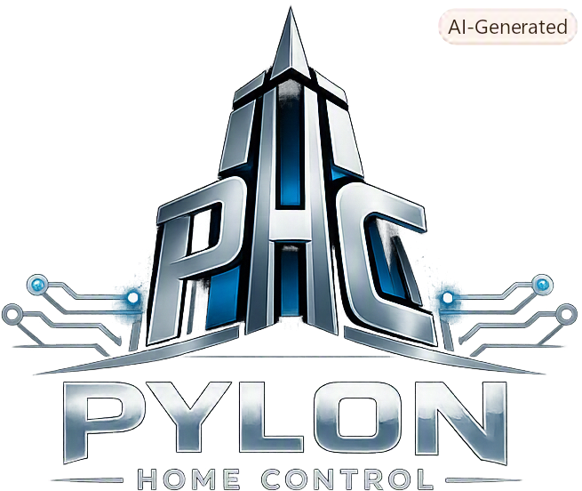

<p align="center">
  
</p>

# Pylon Home Control (PHC)

Pylon Home Control (PHC) is a small, YAML-configured home automation
framework. It polls and controls a tree of pluggable **devices** (weather
stations, sun position, virtual/test devices, and anything you add), and
runs **tasks** — condition- or time-driven automations — against their
state, all on a fixed-heartbeat scheduler.

## Concepts

- **Device** — a node in a tree that exposes zero or more **endpoints**
  (readable/writable state) and may have child devices. Devices are backed
  by a plugin **module** (e.g. `meteoswiss`, `open_meteo`, `waveplus_bridge`,
  `sun`, `virtual`, `host`), declared in a system YAML file.
- **Module** — a device plugin: a `devices/<name>/device.py` (the `Device`
  subclass) plus a `devices/<name>/module.yaml` describing its parameters
  and endpoints declaratively. Modules are discovered automatically at
  startup.
- **Task** — an automation triggered either by a schedule (`time`/`repeat`)
  or by a device endpoint changing (`condition`), performing one or more
  **actions** (`set`, `toggle`, `log`, `create_task`, `kill_task`, `script`,
  ...), with an optional `min_interval` retrigger cooldown.
- **Scheduler** — drives each device's fetch on its own interval and
  evaluates tasks once per heartbeat tick, running device I/O concurrently.

### Endpoint types, units & text

Unless otherwise specified, an endpoint's value is untyped and passes
through unchanged. An endpoint definition may opt into:

- `type` — `int`, `float`, `bool`, or `str`.
- `unit` — a display unit, e.g. `"°C"`, appended when formatting a
  numeric value as text.
- `values` — a raw value → text label mapping, e.g. `{ 0: "off", 1: "on" }`.
- `min`/`max` — a numeric range hint, stored only (never enforced against
  a write) — e.g. used by [`extensions/web_ui/`](extensions/web_ui/) to
  decide whether a writable numeric endpoint gets a bounded slider.

Given these, `Endpoint.to_text()`/`from_text()` (and the matching
`Device.get_text()`/`set_text()`) are the standard way to format a raw
value as display text and to parse text (or a raw value/label, e.g. `1` or
`"on"`) back into the endpoint's raw value — used by the `log` action's
`{text}` placeholder and the `set` action's `value:` parameter.

See [`examples/`](examples/) for complete system configurations, and the
`module.yaml` file in each [`devices/`](devices/) subfolder for what
parameters/endpoints a given device module supports.

[`extensions/`](extensions/) is the home for non-device PHC extensions
(e.g. [`extensions/logdb/`](extensions/logdb/), a CSV-backed sample store,
and [`extensions/random_light/`](extensions/random_light/), randomized
light control), following the same package-plus-descriptor pattern as
device modules.

### Conditions, scripted actions & sticky values

Beyond the `condition: { device, changed }` shorthand (fire when one
endpoint changes) and simple actions like `set`/`toggle`/`log`, a task's
`condition` and a `script` action's `code` can use a small, sandboxed
subset of Python — enough to combine several devices' state, spawn/cancel
tagged follow-up tasks, and read/reset a sticky min/max window, without
writing a new device module or extension:

```yaml
tasks:
  - tag: intrusion
    condition:
      refs: { armed: "security.armed", motion: "hallway.motion" }
      expr: "armed.state == 1 and motion.changed and motion.state == 1"
    min_interval: 5m   # don't refire more than once every 5 minutes
    action:
      kind: script
      code: |
        log("intrusion detected")
        set_state("siren.state", 1)
        create_task({ tag: "siren_off", time: "+3m",
                       action: { kind: "set", device: "siren.state", value: 0 } })
```

Both `condition.expr` and a `script` action's `code` run in the same
restricted sandbox (see `core/scripting.py`) — no imports, no attribute
access beyond a bound ref's `.state`/`.changed`/`.text`/`.event`/`.sticky`,
no method-call chains, no unbounded loops — against one shared set of
functions (`core/task.py`'s `_build_rule_namespace`), so a condition and a
script can never expose different capabilities by accident:

- Always available: `state(ref)`, `changed(ref)`, `text(ref)`, `event(ref)`,
  `sticky(ref)` (a since-last-`reset_sticky()` min/max window, the same
  mechanism `extensions/logdb` uses — see `log_aggregation` above), and
  `devices(pattern)` (a `core/selectors.py` glob, e.g. `"house.*/*"`, usable
  as a `for` target).
- Only in a `script` action (never in a condition, which must stay
  side-effect-free): `set_state(ref, value)`, `create_task(spec)` (same
  shape as a top-level `tasks:` entry), `kill_task(*tag_globs)` (remove
  matching tasks — the declarative form is the `kill_task` action kind),
  `reset_sticky(ref)`, and `log(msg)`.
- `ref` is a `"device.endpoint"` string, either inline (`state("a.b")`) or
  bound to a short name via an optional `refs: { name: "a.b" }` map for the
  `name.state`/`name.changed`/... attribute form used above.

See [`examples/surveillance_system.yaml`](examples/surveillance_system.yaml)
for a fuller worked example (arm/disarm, retriggered intrusion detection,
timed follow-ups, mass-cancel on disarm).

### Random light control

[`extensions/random_light/`](extensions/random_light/) randomizes a set of
"light" devices to make an empty house look occupied — each light gets one
or more on/off time-of-day windows (a fixed local `"HH:MM"`, or
`"sunrise"`/`"sunset"` plus/minus an offset, resolved against a
[`devices/sun/`](devices/sun/) device's live sunrise/sunset), a minimum
switch interval, and a probability of being on. `windows`/`min_interval`/
`probability_on` cascade three ways: [`extension.yaml`](extensions/random_light/extension.yaml)'s
own default → this instance's own `windows`/`min_interval`/`probability_on`
(applies to every light below that doesn't set its own) → each light's own
override:

```yaml
extensions:
  random_light:
    house:
      enable_ref: "surveillance.armed"   # optional: only randomize while armed
      pause_ref: "alarm.state"           # optional: skip entirely during an active alarm
      lights:
        - device: "hallway_light.state"
          default: true   # forced on if, after a pass, no light ended up on
          # no windows/min_interval/probability_on of its own -- inherits
          # extension.yaml's own defaults (see below)
        - device: "porch_light.state"
          windows:
            - { start: "sunset+12m", end: "23:30" }
            - { start: "06:00", end: "sunrise-10m" }
          min_interval: 15m
          probability_on: 0.4

tasks:
  - tag: random_light_tick
    time: "+5s"
    repeat: 1m
    action: { kind: random_light, instance: "random_light.house" }
```

A `kind: random_light` action with `force: 0`/`force: 1` bypasses windows,
probability, and `enable_ref`/`pause_ref` entirely, forcing every
configured light to that value immediately — for a surrounding system to
drop into its own tasks' `actions:` list (e.g. force everything off when
arming/disarming, force everything on as a deterrent during an alarm), as
seen throughout
[`examples/surveillance_system.yaml`](examples/surveillance_system.yaml).

### Mail alerts

[`extensions/mail_alert/`](extensions/mail_alert/) sends a message through
one configured SMTP server — an `extensions.mail_alert.<instance>` entry
holds the server's connection details plus a default sender/recipient
list, and a `kind: mail_alert` task action sends one message through it,
alongside a task's other actions (`set`, `random_light`, ...). A recipient
can be an ordinary mailbox or an email-to-SMS gateway address — both are
just SMTP recipients as far as this extension is concerned. Because a
task's actions run inline on the scheduler's own thread (see Task/Action
above), the actual SMTP send happens on a small background thread pool
instead, so a slow or unreachable mail server can't stall the whole
system — delivery success/failure is logged, not surfaced back to the
firing task:

```yaml
extensions:
  mail_alert:
    house:
      smtp_host: "smtp.example.com"
      username: "alerts@example.com"
      password: "..."           # plain text -- phc has no secrets mechanism; guard this file accordingly
      from: "alerts@example.com"
      to:
        - "someone@example.com"
        - "15555550123@sms.example.com"   # an email-to-SMS gateway, same as any other recipient

tasks:
  - tag: intrusion_alert
    condition: { device: "hallway_motion.state" }
    min_interval: 5m   # don't refire more than once every 5 minutes
    actions:
      - kind: set
        device: "siren.state"
        value: 1
      - kind: mail_alert
        instance: "mail_alert.house"
        title: "Home Security - Alarm Alert"
        message: "Sensor triggered"
```

`to`/`from` on the action itself override the instance's defaults when
given. See
[`examples/surveillance_system.yaml`](examples/surveillance_system.yaml)
for a fuller worked example, wired into its intrusion-detection task.

### Web UI

[`extensions/web_ui/`](extensions/web_ui/) is a small aiohttp.web server
(sharing the scheduler's own event loop) that renders the live device tree
as a browser dashboard — view current status and flip/slide/select new
values — with **no per-device UI code**: each endpoint's widget is
inferred purely from its existing metadata:

| Endpoint                                  | Widget     |
|--------------------------------------------|------------|
| not `writable`                              | label      |
| `writable`, `type: bool`                    | toggle     |
| `writable`, has `values`                    | dropdown   |
| `writable`, numeric, both `min` and `max`   | slider     |
| `writable`, numeric, missing `min` or `max` | number     |
| `writable`, `str` or untyped                | text       |

Layout is either a single flat page (the `selectors` shorthand, default
everything) or an explicit `pages:` list, each holding one or more
collapsible `sections:` (folded by default) that pick their devices via
the same selector syntax `extensions/logdb` uses:

```yaml
extensions:
  web_ui:
    home:
      host: 127.0.0.1
      port: 8080
      refresh_interval: 2s
      pages:
        - id: overview
          title: Overview
          sections:
            - id: lights
              title: Lights
              collapsed: false
              selectors: ["house.*.light*/*"]
            - id: climate
              title: Climate
              selectors: ["house.*/temperature", "house.*/humidity"]
```

Writes POST through the same `Device.set_text()` path a task action uses;
every widget independently polls its own small HTML fragment on
`refresh_interval` to pick up live state (its own write included, once the
next scheduler tick commits it — there is no WebSocket/push channel).
Interactivity is [HTMX](https://htmx.org) and styling is
[PicoCSS](https://picocss.com) — both vendored, unmodified, single-file
static assets (see `extensions/web_ui/static/`), so no project-authored
JS or build tooling is needed.

A section's content is a list of **panels**, dispatched by `kind` (default
`"devices"`, the widgets described above) through a small registry local
to this extension (`extensions/web_ui/panels.py`), independent of
`core/registry.py`. Only `kind: devices` ships today; it's a deliberately
foreseen, not-yet-implemented extension point for a future non-device-tied
panel (e.g. `kind: graph`, a time-series chart over a set of endpoints).

There is no authentication — bind `host` to a trusted interface only
(defaults to `127.0.0.1`, loopback-only). See
[`examples/web_ui_system.yaml`](examples/web_ui_system.yaml) for a
complete runnable example.

## Requirements

- Python >= 3.11
- Dependencies: `PyYAML`, `aiohttp`, `astral`, `Jinja2` (see `pyproject.toml`)

## Install

```
pip install -e .
```

For running the test suite, install the `dev` extra instead:

```
pip install -e ".[dev]"
```

## Usage

Run PHC against one of the example systems:

```
python phc.py --config examples/virtual_system.yaml
```

Useful flags:

- `--log-level LEVEL` — default logging level (`DEBUG`, `INFO`, `WARNING`, `ERROR`).
- `--log-level-module NAME=LEVEL` — override the level of one module's logger
  (e.g. `scheduler=DEBUG`); repeatable.

Stop with Ctrl+C (SIGINT) or SIGTERM for a graceful shutdown.

## Splitting configuration across files

A system YAML can pull in another YAML file with `!include <relative-path>`,
anywhere a value is expected -- a mapping value, a list item, nested
arbitrarily deep:

```yaml
devices:
  - !include common/living_light_device.yaml
  - id: sun
    module: sun
    update: 1h
    params: !include common/sun_zurich_params.yaml
```

The path is resolved relative to the file the `!include` appears in, not the
root config or the current directory, so an included file can itself use
`!include` to pull in further files. This is a plain substitution (the tagged
node is replaced by the included file's parsed content) rather than a merge,
so a shared fragment works best when it's either a fully self-contained block
(e.g. a whole device) or a nested value that doesn't vary between the files
including it (e.g. just the `params:` of a device whose other fields differ
per file). See [`examples/common/`](examples/common/) for fragments shared
between several of the example systems, and any example file under
[`examples/`](examples/) that references them for real usage.

## Adding a device module

A new device type is a new `devices/<name>/` package containing:

- `device.py` — a `Device` subclass decorated with `@register_module("<name>")`.
- `module.yaml` — its declared parameters and endpoints.

See any existing module (e.g. [`devices/virtual/`](devices/virtual/)) for
the minimal shape, or [`devices/meteoswiss/`](devices/meteoswiss/) for a
fuller, network-backed example.

## Tests

```
pytest
```

## License

MIT — see [LICENSE](LICENSE).
