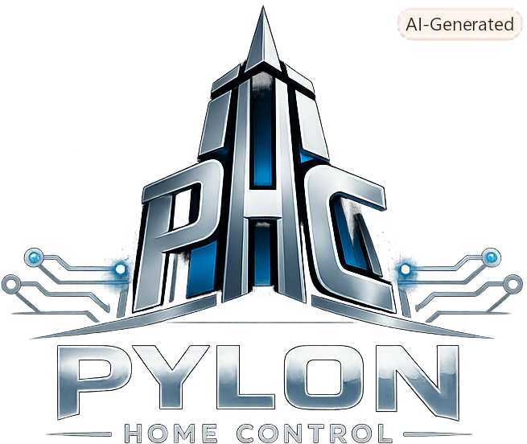

<p align="center">
  
</p>

# Pylon Home Control (PHC)

Pylon Home Control (PHC) is a compact, Python-based, YAML-configured home automation framework for people who prefer describing their home to writing a full application for it. Point PHC at a configuration file and it will poll and control a tree of pluggable **devices** — light switches, PIR sensors, environmental sensors, and anything you choose to integrate — while running **tasks**, condition- or time-driven actions that automate your home or any other system you want to orchestrate.

It's lightweight enough to run comfortably on a Raspberry Pi, flexible enough to grow with your setup, and designed so that adding a new device is simply a matter of extending the configuration and writing a small Python class.

PHC is built with the help of modern AI coding assistants, and its development workflow embraces them. This makes extending the PHC core or creating new device interfaces approachable for developers of all experience levels (see [Contributing](#contributing)).

PHC aims to be a transparent, minimal alternative to heavy home-automation platforms. It is ideal for people who want automation without running a full server stack, and for developers who enjoy understanding and controlling the entire system.


## Features at a Glance

- YAML-based configuration — describe your home declaratively.
- Auto-discovered device modules — plug in new devices without touching the core.
- Declarative tasks — time-based or condition-based automation.
- Concurrent scheduler — efficient polling and task evaluation.
- Lightweight footprint — runs comfortably on a Raspberry Pi.
- Extensible architecture — add devices, extensions, or skills with small Python classes.
- Built-in integrations — mail alerts, random lights, log database, web UI, Z-Wave, timers, recovery, debug portal.
- AI-friendly development workflow — PHC is intentionally structured so AI assistants can help build modules and extensions quickly.


## Quick Start

A minimal PHC configuration looks like this:

```yaml
devices:
  - id: sun
    module: sun
    latitude: 47.3769
    longitude: 8.5417

  - id: living_light
    module: virtual
    endpoints:
      - key: state
        writable: true
        type: int
        values: { 0: "off", 1: "on" }

tasks:
  - tag: evening_lights
    description: "Turn the light on at sunset"
    condition: { device: "sun.is_daylight", changed: true }
    action:
      kind: set
      device: "living_light.state"
      expr: "0 if state('sun.is_daylight') else 1"
```

Validate your configuration:

```
phc validate --config myhome.yaml
```

Run PHC:

```
phc --config myhome.yaml
```


## Concepts

- **Device** — a node in a tree that exposes zero or more **endpoints**
  (readable/writable state) and may have child devices, backed by a
  plugin **module** declared in a system YAML file.

- **Module** — a device plugin: a `phc/devices/<name>/device.py` (the `Device`
  subclass) plus a `phc/devices/<name>/module.yaml` describing its parameters
  and endpoints declaratively. Modules are discovered automatically at
  startup.

- **Task** — an automation triggered either by a schedule (`time`/`repeat`)
  or by a device endpoint changing (`condition`), performing one or more
  **actions** (`set`, `toggle`, `log`, `create_task`, `kill_task`, `script`,
  ...).

- **Scheduler** — drives each device's fetch on its own interval and
  evaluates tasks once per heartbeat tick, running device I/O concurrently.

See [`docs/concepts.md`](docs/concepts.md) for the full picture (including endpoint types/units/formatting), and [`examples/`](examples/) for complete system configurations.


## Documentation

### User Guide
Located in [`docs/`](docs/):

- Core concepts — [`docs/concepts.md`](docs/concepts.md)
- Configuration reference — [`docs/configuration.md`](docs/configuration.md)
- Endpoint and device profiles — [`docs/profiles.md`](docs/profiles.md)
- Conditions, scripting, sticky values — [`docs/scripting.md`](docs/scripting.md)
- Extensions and integrations:
  - [`docs/random-light.md`](docs/random-light.md)
  - [`docs/mail-alert.md`](docs/mail-alert.md)
  - [`docs/logdb.md`](docs/logdb.md)
  - [`docs/recovery.md`](docs/recovery.md)
  - [`docs/timer.md`](docs/timer.md)
  - [`docs/web-ui.md`](docs/web-ui.md)
  - [`docs/debug-portal.md`](docs/debug-portal.md)
  - [`docs/zway.md`](docs/zway.md)
- Raspberry Pi installation — [`docs/raspberry-pi-install.md`](docs/raspberry-pi-install.md)

### Developer Guide
Located in [`docs/developer/`](docs/developer/):

- Architecture — [`docs/developer/architecture.md`](docs/developer/architecture.md)
- Writing a device module — [`docs/developer/writing-a-device-module.md`](docs/developer/writing-a-device-module.md)
- Adding a device with an AI assistant — [`docs/developer/agentic-adding-a-device.md`](docs/developer/agentic-adding-a-device.md)
- Writing an extension — [`docs/developer/writing-an-extension.md`](docs/developer/writing-an-extension.md)
- Writing a skill — [`docs/developer/agentic-creating-a-skill.md`](docs/developer/agentic-creating-a-skill.md)
- Internals:
  - [`docs/developer/zway.md`](docs/developer/zway.md)
  - [`docs/developer/web-ui.md`](docs/developer/web-ui.md)
  - [`docs/developer/timer.md`](docs/developer/timer.md)
  - [`docs/developer/debug-portal.md`](docs/developer/debug-portal.md)


## Installation and Usage

### Requirements

- Python >= 3.11
- Dependencies: `PyYAML`, `aiohttp`, `astral`, `Jinja2` (see `pyproject.toml`)

### Install

```
pip install -e .
```

### Usage

Run PHC against one of the example systems:

```
phc --config examples/virtual_system.yaml
```

(`pip install -e .` installs the `phc` console command; `python -m phc
--config ...` works the same way when run from the repo root without
installing.)

Subcommands:

- `phc validate --config FILE` — load the config and report what it builds,
  without starting the scheduler, binding a port or touching hardware.
  Exits non-zero if the config is broken, so it works as a pre-deploy check.

- `phc list-modules` / `phc list-extensions` — what this installation can
  use, with each one's package, description and declared parameters. Add
  `--plugin-path DIR` to include out-of-tree plugins.

Useful flags:

- `--log-level LEVEL` — default logging level (`DEBUG`, `INFO`, `WARNING`, `ERROR`);
  applies to every stream (`stdout`/`stderr`) destination in `log:`, never a
  file destination — see [Logging](docs/configuration.md#logging).

- `--log-level-module NAME=LEVEL` — override the level of one logger (e.g.
  `scheduler=DEBUG`) on every stream destination; repeatable.

Stop with Ctrl+C (SIGINT) or SIGTERM for a graceful shutdown.


## Why PHC?

PHC is intentionally small, transparent, and easy to understand. Unlike large
home-automation platforms:

- You don't run a full server stack.
- You don't manage dozens of services.
- You don't need a database, message bus, or plugin manager.
- You can read the entire core and understand it in an afternoon.

PHC is ideal for:

- Raspberry Pi setups
- Custom hardware integrations
- Developers who want full control
- People who prefer YAML + small Python classes over large GUIs
- AI-assisted development workflows


## Contributing

Contributions of all kinds are welcome — bug fixes, new devices,
extensions, docs. See `CONTRIBUTING.md` for the development workflow,
including how to add a new device interface, and `CHANGELOG.md` for
release history.

AI coding assistants will help you build modules, extensions, and skills
quickly.


## License

MIT — see [LICENSE](LICENSE).
