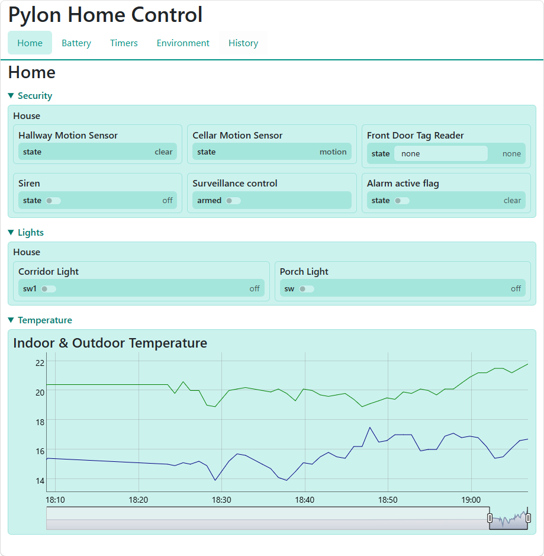

<p align="center">
  
</p>

# Pylon Home Control (PHC)

[](https://www.python.org/)
[](LICENSE)
[](docs/developer/agentic-adding-a-device.md)

Pylon Home Control is a compact home automation framework: describe your home
in YAML, and PHC polls and controls a tree of pluggable **devices** — light
switches, PIR sensors, environmental sensors, anything you integrate — while
running **tasks**, the condition- and time-driven actions that automate it.

It runs comfortably on a Raspberry Pi, and adding a new device means writing a
small Python class plus a YAML descriptor — nothing in the core changes.


## Contents

- [Why PHC?](#why-phc)
- [Concepts](#concepts)
- [Quick Start](#quick-start)
- [Documentation](#documentation)
- [Installation and Usage](#installation-and-usage)
- [Contributing](#contributing)
- [License](#license)


## Why PHC?

PHC is a transparent, minimal alternative to heavy home-automation platforms.
You don't run a server stack, manage dozens of services, or need a database,
message bus or plugin manager — and you can read the entire core and
understand it in an afternoon.

- **YAML-based configuration** — describe your home declaratively.
- **Auto-discovered device modules** — plug in new devices without touching the core.
- **Declarative tasks** — time-based or condition-based automation.
- **Concurrent scheduler** — efficient polling and task evaluation.
- **Lightweight footprint** — runs comfortably on a Raspberry Pi. On a
  Raspberry Pi 4, one instance polling 60 endpoints across z-Way,
  meteoswiss, and waveplus_bridge uses well under 1% CPU and ~50MB RSS.
- **Built-in integrations** — mail alerts, random lights, log database, web UI,
  Z-Wave, timers, recovery, debug portal.
- **AI-friendly development workflow** — PHC is intentionally structured so AI
  assistants can help build modules and extensions quickly, which makes
  extending it approachable for developers of all experience levels.

It suits Raspberry Pi setups, custom hardware integrations, and developers who
prefer YAML plus small Python classes over large GUIs.


## Concepts

- **Device** — a node in a tree that exposes zero or more **endpoints**
  (readable/writable state) and may have child devices, backed by a
  plugin **module** declared in a system YAML file.

- **Module** — a device plugin: a `phc/devices/<name>/device.py` (the `Device`
  subclass) plus a `phc/devices/<name>/module.yaml` describing its parameters
  and endpoints declaratively. Modules are discovered automatically at
  startup.

- **Task** — an automation triggered either by a schedule (`time`/`repeat`)
  or by a device endpoint changing (`condition`), performing one or more
  **actions** (`set`, `toggle`, `log`, `create_task`, `kill_task`, `script`,
  ...).

- **Scheduler** — drives each device's fetch on its own interval and
  evaluates tasks once per heartbeat tick, running device I/O concurrently.

See [`docs/concepts.md`](docs/concepts.md) for the full picture (including endpoint types/units/formatting), and [`examples/`](examples/) for complete system configurations.


## Quick Start

**1. Clone the repository and enter it:**

```bash
git clone https://github.com/Drolla/phc.git
cd phc
```

**2. Create and activate a virtual environment.** On Debian-based systems
(including Raspberry Pi OS), the system Python is "externally managed"
(PEP 668) and refuses a direct `pip install`, so a venv is required rather
than optional:

```bash
python3 -m venv .venv
source .venv/bin/activate
```

**3. Install the required Python modules:**

```bash
pip install -e .
```

**4. Try it out with one of the bundled examples**, no config of your own
needed yet:

```bash
python -m phc --config examples/emulated_full_system.yaml
```

Open `http://<HostID>:8080` in a browser for the web UI, and
`http://<HostID>:8081` for the debug portal's live task queue (`<HostID>`
is `localhost` if you're browsing from the same machine, or the host's
network address/hostname otherwise).

**5. Write the configuration file of your system**, using
[`docs/configuration.md`](docs/configuration.md) as reference. A minimal PHC
configuration looks like this:

```yaml
devices:
  - id: sun
    module: sun
    latitude: 47.3769
    longitude: 8.5417

  - id: living_light
    module: virtual
    endpoints:
      - key: state
        writable: true
        type: bool
        values: { false: "off", true: "on" }

tasks:
  - tag: evening_lights
    description: "Turn the light on at sunset"
    condition: { device: "sun.is_daylight", changed: true }
    action:
      kind: set
      device: "living_light.state"
      expr: "not state('sun.is_daylight')"
```

**6. Validate your configuration:**

```bash
python -m phc validate --config myhome.yaml
```

**7. Run PHC:**

```bash
python -m phc --config myhome.yaml
```


## Documentation

### User Guide
Located in [`docs/`](docs/):

- Core concepts — [`docs/concepts.md`](docs/concepts.md)
- Configuration reference — [`docs/configuration.md`](docs/configuration.md)
- Endpoint and device profiles — [`docs/profiles.md`](docs/profiles.md)
- Conditions, scripting, sticky values — [`docs/scripting.md`](docs/scripting.md)
- Extensions and integrations:
  - [`docs/random-light.md`](docs/random-light.md)
  - [`docs/mail-alert.md`](docs/mail-alert.md)
  - [`docs/logdb.md`](docs/logdb.md)
  - [`docs/recovery.md`](docs/recovery.md)
  - [`docs/timer.md`](docs/timer.md)
  - [`docs/web-ui.md`](docs/web-ui.md)
  - [`docs/debug-portal.md`](docs/debug-portal.md)
  - [`docs/zway.md`](docs/zway.md)
- Raspberry Pi installation — [`docs/raspberry-pi-install.md`](docs/raspberry-pi-install.md)

### Developer Guide

Start with [`CONTRIBUTING.md`](CONTRIBUTING.md) for the development workflow, setup instructions, and how to add a device module or extension.

Detailed documentation is located in [`docs/developer/`](docs/developer/):

- Architecture — [`docs/developer/architecture.md`](docs/developer/architecture.md)
- Writing a device module — [`docs/developer/writing-a-device-module.md`](docs/developer/writing-a-device-module.md)
- Adding a device with an AI assistant — [`docs/developer/agentic-adding-a-device.md`](docs/developer/agentic-adding-a-device.md)
- Writing an extension — [`docs/developer/writing-an-extension.md`](docs/developer/writing-an-extension.md)
- Writing a skill — [`docs/developer/agentic-creating-a-skill.md`](docs/developer/agentic-creating-a-skill.md)
- Internals:
  - [`docs/developer/zway.md`](docs/developer/zway.md)
  - [`docs/developer/web-ui.md`](docs/developer/web-ui.md)
  - [`docs/developer/timer.md`](docs/developer/timer.md)
  - [`docs/developer/debug-portal.md`](docs/developer/debug-portal.md)


## Installation and Usage

### Requirements

- Python >= 3.11
- Dependencies: `PyYAML`, `aiohttp`, `astral`, `Jinja2` (see `pyproject.toml`)

### Usage

Run PHC against one of the example systems:

```bash
phc --config examples/emulated_system.yaml
```

(`pip install -e .` installs the `phc` console command; `python -m phc
--config ...` works the same way when run from the repo root without
installing.)

Subcommands:

- `phc validate --config FILE` — load the config and report what it builds,
  without starting the scheduler, binding a port or touching hardware.
  Exits non-zero if the config is broken, so it works as a pre-deploy check.

- `phc list-modules` / `phc list-extensions` — what this installation can
  use, with each one's package, description and declared parameters. Add
  `--plugin-path DIR` to include out-of-tree plugins.

Useful flags:

- `--log-level LEVEL` — default logging level (`DEBUG`, `INFO`, `WARNING`, `ERROR`);
  applies to every stream (`stdout`/`stderr`) destination in `log:`, never a
  file destination — see [Logging](docs/configuration.md#logging).

- `--log-level-module NAME=LEVEL` — override the level of one logger (e.g.
  `scheduler=DEBUG`) on every stream destination; repeatable.

Stop with Ctrl+C (SIGINT) or SIGTERM for a graceful shutdown.


## Contributing

Contributions of all kinds are welcome — bug fixes, new devices,
extensions, docs. See [`CONTRIBUTING.md`](CONTRIBUTING.md) for the development workflow,
including how to add a new device interface, and [`CHANGELOG.md`](CHANGELOG.md) for
release history.

AI coding assistants will help you build modules, extensions, and skills
quickly.


## License

MIT — see [LICENSE](LICENSE).
